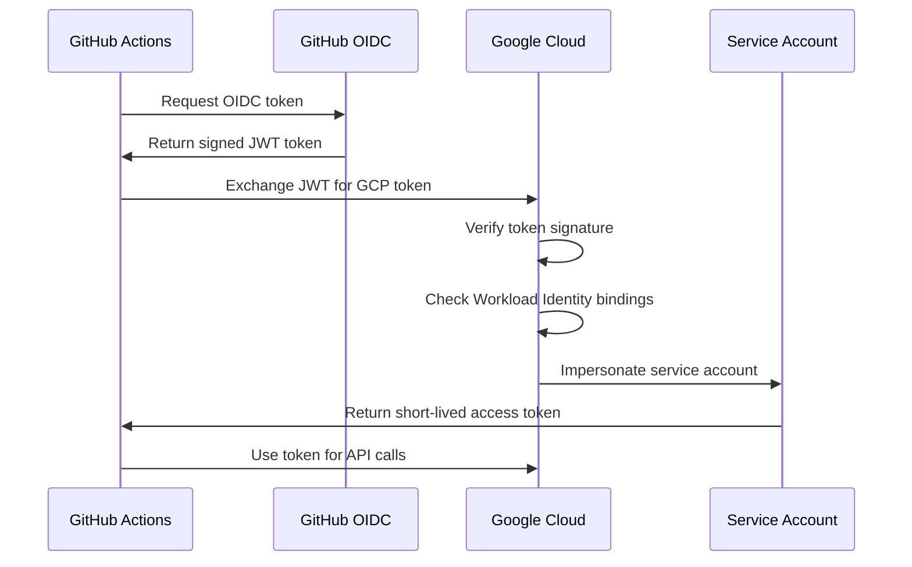

# Workload Identity Federation Setup Guide

## ?? Organization Policy Issue Resolved!

If you got this error:
```
ERROR: (gcloud.iam.service-accounts.keys.create) FAILED_PRECONDITION: 
Key creation is not allowed on this service account.
constraints/iam.disableServiceAccountKeyCreation
```

**Good news!** This is a **security best practice** that your organization enforces. We'll use **Workload Identity Federation** instead, which is **MORE SECURE** than service account keys!

## ?? What is Workload Identity Federation?

Instead of using static JSON keys that can be stolen or leaked, Workload Identity Federation allows GitHub Actions to:
- ? Get **short-lived tokens** directly from Google Cloud
- ? No JSON keys to manage, rotate, or secure
- ? Automatic token rotation (tokens expire in minutes)
- ? Better audit logs and security
- ? Complies with organization security policies

## ?? Quick Setup (3 Steps - 10 Minutes)

### Step 1: Run the Setup Script

```powershell
# Navigate to workflows directory
cd .github\workflows

# Run the setup script
.\setup-gcp-workload-identity.ps1
```

**The script will:**
1. Create a service account with required permissions
2. Create a Workload Identity Pool
3. Create a Workload Identity Provider for GitHub
4. Configure the service account for impersonation
5. Output three secrets you need

**Output Example:**
```
?? Configuration Complete!
========================================

Add these secrets to your GitHub repository:
https://github.com/Tolli/dotnet-starter-kit/settings/secrets/actions

GCP_PROJECT_ID
main-project-483817

GCP_SERVICE_ACCOUNT
github-actions@main-project-483817.iam.gserviceaccount.com

GCP_WORKLOAD_IDENTITY_PROVIDER
projects/123456789/locations/global/workloadIdentityPools/github-pool/providers/github-provider
```

### Step 2: Add Secrets to GitHub

1. Go to your repository: `https://github.com/Tolli/dotnet-starter-kit/settings/secrets/actions`
2. Click **New repository secret**
3. Add these three secrets:

| Secret Name | Value (from script output) |
|-------------|---------------------------|
| `GCP_PROJECT_ID` | `main-project-483817` |
| `GCP_SERVICE_ACCOUNT` | `github-actions@...` |
| `GCP_WORKLOAD_IDENTITY_PROVIDER` | `projects/123456789/...` |

### Step 3: Update Workflow Files (Already Done!)

The workflow files have been updated to use Workload Identity:
- ? `.github/workflows/deploy-server.yml`
- ? `.github/workflows/deploy-client.yml`

They now use:
```yaml
- name: Authenticate to Google Cloud
  uses: google-github-actions/auth@v2
  with:
    workload_identity_provider: ${{ secrets.GCP_WORKLOAD_IDENTITY_PROVIDER }}
    service_account: ${{ secrets.GCP_SERVICE_ACCOUNT }}
```

Instead of:
```yaml
# OLD (insecure)
with:
  credentials_json: ${{ secrets.GCP_SA_KEY }}
```

## ? Verify Setup

### Test Locally
```powershell
# Check if Workload Identity Pool exists
gcloud iam workload-identity-pools describe github-pool --location=global

# Check if provider exists
gcloud iam workload-identity-pools providers describe github-provider `
  --location=global `
  --workload-identity-pool=github-pool

# Check service account permissions
gcloud projects get-iam-policy main-project-483817 `
  --flatten="bindings[].members" `
  --filter="bindings.members:serviceAccount:github-actions@*"
```

### Test in GitHub Actions
1. Go to **Actions** tab
2. Select **CD - Deploy Server to Kubernetes**
3. Click **Run workflow**
4. Monitor the "Authenticate to Google Cloud" step
5. Should complete successfully without any key errors

## ?? Troubleshooting

### Issue: APIs not enabled
```
ERROR: API [...] is not enabled for project
```

**Solution:**
```powershell
gcloud services enable iam.googleapis.com
gcloud services enable cloudresourcemanager.googleapis.com
gcloud services enable iamcredentials.googleapis.com
gcloud services enable sts.googleapis.com
```

### Issue: Permission denied creating pool
```
ERROR: You do not have permission to create workload identity pools
```

**Solution:**
You need `roles/iam.workloadIdentityPoolAdmin` role. Ask your GCP admin to grant it:
```bash
gcloud projects add-iam-policy-binding main-project-483817 \
  --member="user:your-email@example.com" \
  --role="roles/iam.workloadIdentityPoolAdmin"
```

### Issue: GitHub Actions auth fails
```
Error: google-github-actions/auth failed with: failed to generate Google Cloud access token
```

**Solution:**
1. Verify all three secrets are set correctly in GitHub
2. Check the repository name in the setup script matches your repo
3. Ensure `id-token: write` permission is set in workflow

## ?? Comparison: Keys vs Workload Identity

| Feature | Service Account Keys | Workload Identity Federation |
|---------|---------------------|----------------------------|
| **Security** | ? Static, can be stolen | ? Short-lived tokens |
| **Rotation** | ?? Manual every 90 days | ? Automatic |
| **Audit Trail** | ?? Limited | ? Excellent |
| **Organization Policy** | ? Often blocked | ? Compliant |
| **Expiration** | ? Never (unless revoked) | ? Minutes |
| **Storage** | ? GitHub Secrets (risk) | ? No storage needed |
| **Setup Complexity** | ? Simple | ?? Slightly more complex |

## ?? How It Works



1. GitHub Actions requests an OIDC token from GitHub
2. GitHub signs the token with information about the workflow
3. GitHub Actions sends this token to Google Cloud
4. Google Cloud verifies the token is from GitHub
5. Google Cloud checks if this repo is allowed to use the service account
6. Google Cloud issues a short-lived access token (1 hour)
7. GitHub Actions uses this token to deploy

## ?? Security Benefits

1. **No Secrets to Steal**
   - No JSON keys in GitHub Secrets
   - Tokens exist only in memory during workflow run

2. **Automatic Expiration**
   - Tokens expire after 1 hour
   - Can't be reused even if intercepted

3. **Repository-Specific**
   - Only your specific repository can use the service account
   - Other repos can't impersonate it

4. **Audit Trail**
   - Every token exchange is logged
   - Can see exactly when and how access occurred

5. **Organization Compliant**
   - Meets security policies that ban service account keys
   - Follows Google Cloud best practices

## ?? Additional Resources

- [GitHub Actions OIDC](https://docs.github.com/en/actions/deployment/security-hardening-your-deployments/about-security-hardening-with-openid-connect)
- [Workload Identity Federation](https://cloud.google.com/iam/docs/workload-identity-federation)
- [Google Cloud Auth Action](https://github.com/google-github-actions/auth)
- [Best Practices for Service Account Keys](https://cloud.google.com/iam/docs/best-practices-for-managing-service-account-keys)

## ?? Next Steps

After setup:
1. ? Test a deployment to verify it works
2. ? Delete any old service account keys (if you had them)
3. ? Document the setup for your team
4. ? Set up similar authentication for other CI/CD pipelines

---

**?? You're now using the most secure authentication method for GitHub Actions!**
